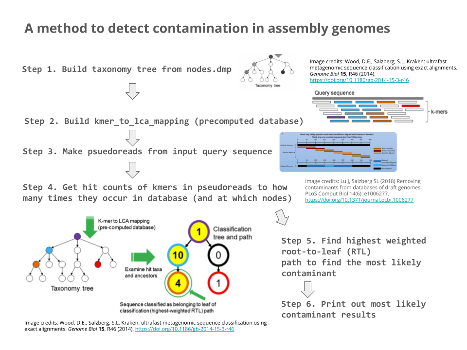

# computational-genomics-team-47
computational-genomics-team-47 Fall 2023 - Dr. Langmead's Computational Genomics: Sequences

## Overview

Our program has 6 steps, which are identified in the below picture:

Each step roughly corresponds to a separate `.py` file.

The `main.py` file is the one that runs the entire contamination classification program.

## Repository Folder Structure Summary
- `src` contains the Python program that classifies contaminants in reads user a exact matching k-mer database (and the least common ancestor algorithm and root-to-leaf paths).
- The program is structured chronologically like below:
  - 0) `main.py` (main method starts here)
  - 1) `taxonomy_tree.py` 
  - 2) `kmer_to_lca_mapping.py`
  - 3) `psuedoreads.py`
  - 4) `get_kmer_hit_counts.py`
  - 5) `root_to_leaf_paths.py`
  - 6) `print_summary_contaminants_found()` (in `main.py`)
- `genomes-of-common-contaminants` contains approximately 20 genomes (totalling ~90 MB) of bacteria and viruses that common contaminate DNA sequences (Mycoplasma, Eschericia lambda phage phiX174, etc.)
- `taxonomy` contains:
  - `nodes.dmp` (~243 MB) which is a file of the taxonomy of all organisms in the tree of life, each represented with a unique integer taxonomy id.
  - `names.dmp` (~183 MB) which maps each integer taxonomy id to the common plaintext name of the species.

## Dependencies
### `python` 3
### `pip`
- None so far.

## Authors
- Dhruv Dubey
- Mitra Harpale
- Christopher Li
- Jaeyoon Wang
