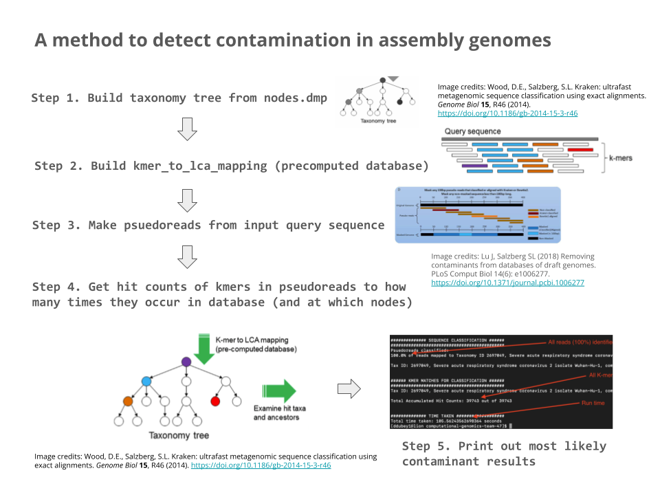

# computational-genomics-team-47
This is the `git` repository for the Final Project of Team 47 in Computational Genomics: Sequences, taught by Dr. Langmead in Fall 2023. Our team is:

- Dhruv Dubey
- Mitra Harpale
- Christopher Li
- Jaeyoon Wang

The goal of our project is to identify contaminants in genomes using a k-mer to LCA (least common ancestor) mapping, based off of the method used in Kraken, a metagenomics classifcation program by Derrick Wood and Steven Salzberg.

## How to run the program / Usage
- `cd computational-genomics-team-47/`
  - Entering the directory

- Now the program is in the correct working directory (the root). Please refer to the below section for specific reproducible runs of the program.

### Specific Reproducible Runs of the Program

Below we describe specific runs of the program, reproducible on the ugrad machines, and their expected results.

- *`python3 src/main.py --input-query covid-assemblies/covid-assembly-1.txt`*
  - As described in section 5.2, Table 2, the output of this run should classify the assembly as 100% reads from COVID:
    - "`100.0% of reads mapped to Taxonomy ID 2697049, Severe acute respiratory syndrome coronavirus 2 isolate Wuhan-Hu-1, complete genome`"

  - *`python3 src/main.py --input-query covid-assemblies/covid-assembly-2.txt`*
  - *`python3 src/main.py --input-query covid-assemblies/covid-assembly-3.txt`*
  - ... (for files `4` through `8`)
  - *`python3 src/main.py --input-query covid-assemblies/covid-assembly-9.txt`*
    - The output of these assemblies should also classify the assembly as 100% reads from COVID.
      - "`100.0% of reads mapped to Taxonomy ID 2697049, Severe acute respiratory syndrome coronavirus 2 isolate Wuhan-Hu-1, complete genome`"

- *`python3 src/main.py --input-query covid-assemblies/covid-contaminated-with-phiX174.txt`*
  - As described in section 5.5 of the writeup, the output of this run should classify the assembly as 85.14% reads from COVID, and 14.86% of reads as E. coli phage phiX174.
    - "`85.71% of reads mapped to Taxonomy ID 2697049, Severe acute respiratory syndrome coronavirus 2 isolate Wuhan-Hu-1, complete genome, 14.29% of reads mapped to Taxonomy ID 2886930, Escherichia phage phiX174, complete genome`"

To summarize, the program can be run on any of the 9 input assemblies, `covid-assemblies/covid-assembly-i.txt`, where `i` is one of `1`, `2`, ..., `9`. 

### Which reference database to select

- Due to memory constraints on the ugrad machines, our group believes it is best to run commands on ugrad machines using the below two options (which are by default included if the option is entirely omitted),
  - `--db new-tutorial-reference-database`
  - `--k 31`
- The reason for this is because the `new-tutorial-reference-database` contains shortened versions of bacterial genomes so that a `MemoryError` does not occur on the ugrad machines.
- On machines with more memory, one may want to try the combination:
  - `--db genomes-of-common-contaminants`
  - `--k 31`
- where the `genomes-of-common-contaminants` contains the full genomes for approximately 20 bacteria and viruses, which are about 90 MB of `.fasta` file on the disk at rest. This seems to be too large for the ugrad machines, which is why it is preferable to use the `new-tutorial-reference-database`.

### Additional command line options
For reference, here is an example invocation of the program providing all optional arguments that are available:

- `python3 src/main.py --db new-tutorial-reference-database/ --input-query covid-assemblies/covid-assembly-1.txt --taxonomy taxonomy --taxonomy-ids taxonomy/custom_taxonomy_ids.txt --k 31`

The arguments are outlined below:
- `--db`
  - Name of the directory containing the database of known contaminants which you want to cross-check the input sequence for (default: `new-tutorial-reference-database`)
- `--input-query`
  - Filename of the sequence in which the program will search for contaminants (required)
- `--taxonomy`
  - Name of the directory containing the taxonomy (including `names.dmp` and `nodes.dmp`) (default: `taxonomy`)
- `--taxonomy-ids`
  - Name of the plaintext file (default: `taxonomy/custom_taxonomy_ids.txt`) which contains taxonomy ids sourced from NCBI corresponding to the NCBI accession IDs of the FASTA files in the database
- `--k`
  - k, the length of the kmer (default: k = 31, which runs on the ugrad machines well using the new-tutorial-reference-database (within memory constraints). k = 31 is ideal if the computer has enough memory. Otherwise, k = 12 may work better.)

## Overview of methods

Our program has 5 steps, which are identified in the below picture:

Each step roughly corresponds to a separate `.py` file.

The `main.py` file is the one that runs the entire contamination classification program.

## Repository Folder Structure Summary
- `src` contains the Python program that classifies contaminants in reads user a exact matching k-mer database (and the least common ancestor algorithm).
- The program is structured chronologically like below:
  - (0.) `main.py` (main method starts here)
  - (1.) `taxonomy_tree.py` 
  - (2.) `kmer_to_lca_mapping.py`
  - (3.) `psuedoreads.py`
  - (4.) `get_kmer_hit_counts.py`
  - (5.) `print_summary_contaminants_found()` (in `main.py`)
- `new-tutorial-reference-database` contains approximately 20 genomes (totalling ~90 MB) of bacteria and viruses that common contaminate DNA sequences (Mycoplasma, Eschericia lambda phage phiX174, etc.)
  - `genomes-of-common-contaminants` is a fuller version of this database.
  - `gocc-shortened` is a condensed version of this database.
- `covid-assemblies` contains 9 input sequences that are fed into the program and checked for contamination.
- `taxonomy` contains:
  - `nodes.dmp` (~243 MB) which is a file of the taxonomy of all organisms in the tree of life, each represented with a unique integer taxonomy id.
  - `names.dmp` (~183 MB) which maps each integer taxonomy id to the common plaintext name of the species.

## Dependencies
### `python3`
### `pip`
- None so far.

## Authors
- Dhruv Dubey
- Mitra Harpale
- Christopher Li
- Jaeyoon Wang
